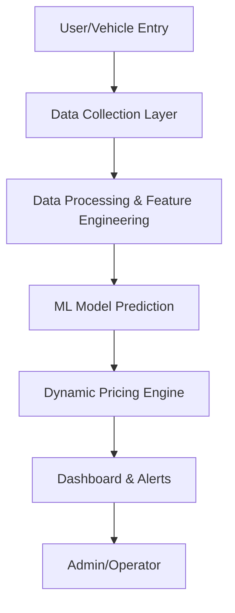
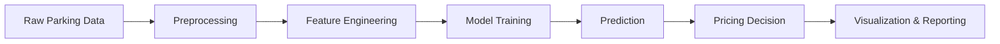

<p align="center">
  
  
</p>

# Dynamic Parking Pricing Capstone Project

<p align="center">
  
</p>

<p align="center">
  <b>Indian Institute of Technology Guwahati</b>  
  <b>Pathways Program</b>
</p>

---

## 🚗 Project Overview

This project presents a dynamic parking pricing system leveraging machine learning and data analytics to optimize parking space utilization and maximize revenue. The solution integrates real-time data, predictive modeling, and interactive dashboards for actionable insights and automated pricing adjustments.

---

## 🛠️ Tech Stack

- **Python** (Pandas, NumPy, Scikit-learn, CatBoost, LightGBM, Bokeh)
- **Jupyter Notebook**
- **Visualization:** Bokeh, Matplotlib
- **Data:** Custom datasets, CSV
- **Documentation:** Markdown, Mermaid, PNG, GIF

---

## 🏗️ System Architecture

<p align="center">
  
</p>



---

## 🔄 Data Flow Diagram

<p align="center">
  
</p>



---

## ⚙️ Workflow with Technologies

<p align="center">
  
</p>

---

## ✨ Features

- Three dynamic pricing models for parking:
  - **Model 1:** Linear price adjustment based on occupancy.
  - **Model 2:** Multi-factor demand-based pricing (occupancy, queue, traffic, special events, vehicle type).
  - **Model 3:** Competitive pricing using geospatial analysis of nearby lots.
- Real-time simulation and streaming with Pathway.
- Interactive Bokeh dashboard for real-time price visualization.
- Advanced historical pattern recognition and temporal demand features.
- Intelligent rerouting system for overloaded lots.
- Comprehensive business intelligence and executive reporting.
- All code, data processing, and visualizations in a single, reproducible notebook.

---

## 📁 Project Structure

```text
Capstone_Project/
│   IIT.ipynb                # Main notebook (code, models, visualizations)
│   Readme.md                # Project documentation
│   High-Level System Architecture.png
│   Detailed Data Flow & Model Logic.png
│   Workflow with Technologies.png
│   ...
```

---

## 🚀 Getting Started

1. **Clone the repository**
2. Open `IIT.ipynb` in Jupyter Notebook
3. Install dependencies from `requirements.txt`
4. Run all cells to reproduce results and visualizations

---

## 📊 Resources & References

- Project dataset: 14 urban parking lots, 73 days, 18,000+ records.
- Libraries: pandas, numpy, matplotlib, seaborn, geopy, pathway, bokeh, scipy.
- [Pathway documentation](https://pathway.com/)
- [Bokeh documentation](https://docs.bokeh.org/en/latest/)
- [Geopy documentation](https://geopy.readthedocs.io/)
- [IIT Guwahati](https://www.iitg.ac.in/)
- [Summer Analytics 2025 - Consulting & Analytics Club × Pathway]

---

## 👤 Author & Contact

**T Mohamed Yaser**  
Email: [1ammar.yaser@gmail.com](mailto:1ammar.yaser@gmail.com)  
LinkedIn: [mohamedyaser08](https://www.linkedin.com/in/mohamedyaser08/)  
Website: [mohdyaser.vercel.app](https://mohdyaser.vercel.app/)

<p align="center">
  
</p>

---

<p align="center">
  <i>Capstone Project &copy; 2025 | IIT Guwahati | Pathways</i>
</p>
